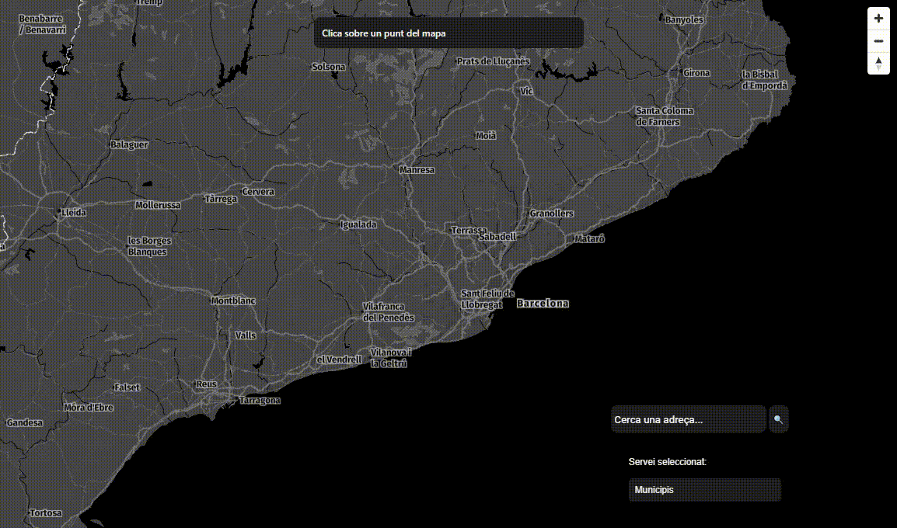
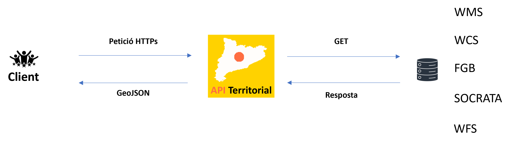

# API Territorial

versió 1.0.0

## Què és?

Benvinguts a l'API Territorial de l'ICGC, una Interfície de Programació d'Aplicacions
(<i>Application Programming Interface</i>) que consisteix en una eina que integra diverses fonts de dades geogràfiques per proporcionar-te
informació precisa i detallada del territori a partir d'unes coordenades geogràfiques o UTM.

## Com funciona?

Es tracta d'una API REST que funciona a partir d'un protocol HTTPS. Es basa tot en un motor de cerca que gestiona les peticions (segons el format) i realitza la connexió amb la base de dades o la consulta corresponent al servei WMS/WFS/WCS, i dona com a resposta una col·lecció en format GeoJSON.

Envia un parell de coordenades del territori de Catalunya i la nostra API et retornarà un GeoJSON amb els serveis que intersecten amb aquestes ubicacions. Les peticions es poden personalitzar amb el paràmetre 'servei', permetent-te seleccionar-los tots (all), o seleccionar serveis específics pel seu nom (separats per coma).
  

## Casos d'ús

-<b> Explora el territori a la teva manera:</b> descobreix dades detallades sobre municipis, comarques o altres serveis, i visualitza-les en un mapa interactiu.

-<b> Comprèn el paisatge amb detall:</b> analitza la distribució de la vegetació, la topografia i d'altres característiques geogràfiques en una àrea específica.

-<b> Planifica el futur de les zones urbanes:</b> accedeix a dades sobre usos del sòl, vegueries i d'altres serveis per a una planificació urbana informada.

-<b> Gestió forestal:</b> visualitza dades sobre incendis i vegetació a Catalunya per a una correcta planificació i gestió forestal.

-<b> Gestió de recursos hídrics:</b> planifica i monitora els recursos hídrics amb dades essencials sobre aqüífers i conques hidrogràfiques.

-<b> Navegació intuïtiva pel teu entorn:</b> utilitza la informació detallada del Sistema d'Orientació Cartogràfica per explorar i orientar-te amb facilitat.

-<b> Anàlisi de salut pública:</b> utilitza les "Àrees Bàsiques de Salut" i les "Regions Sanitàries" per aprofundir en anàlisis epidemiològiques i planificació de serveis de salut.

-<b> Planificació del territori per a serveis socials:</b> empra les "Àrees Bàsiques de Serveis Socials" per analitzar la distribució de serveis socials i identificar àrees amb necessitats creixents.

-<b> Seguretat pública i policial:</b> utilitza les "Àrees Bàsiques Policials" per a la planificació de recursos policials i la identificació de zones amb necessitats especials de seguretat.

-<b> Gestió hidrològica detallada:</b> explora les "Subconques hidrològiques" per a una gestió més precisa dels recursos hídrics a nivell local.

-<b> Anàlisi de dades cadastrals:</b> utilitza les "Parcel·les cadastrals" per a l'anàlisi detallada de la propietat del sòl i la planificació del desenvolupament urbà.

  

## Exemples

A la secció API-Examples proporcionem demostracions pràctiques per ajudar-te a connectar-te a l'API i fer peticions. Això facilita la implementació ràpida i eficient als teus projectes.

- [Exemples](Peticio.md)

   

## Documentació

Explora la secció API-Docs per veure i testejar tots els serveis i mètodes disponibles. Amb una interfície intuïtiva, podràs comprendre fàcilment com utilitzar cada servei i personalitzar les teves peticions.

- [API Docs](apidocs.md)

   

## Visualització en temps real

A la secció API-Viewer pots veure el funcionament de l'API en temps real. Selecciona qualsevol servei en un desplegable i visualitza'l fàcilment fent clic sobre el mapa interactiu.

- [Visor - API Viewer](3.1.0.Map.md)
    

## Llicència

Dades de l'ICGC: Llicència de Reconeixement 4.0 Internacional de Creative Commons. [Més informació](https://www.icgc.cat/ca/L-ICGC/Informacio-publica/Transparencia/Reutilitzacio-de-la-informacio) 
Dades d'altres administracions: [Enllaç](https://administraciodigital.gencat.cat/ca/dades/dades-obertes/informacio-practica/llicencies/)

## Versionat

Versió 1.0.0

##

##### Autor i Contacte

<small>[Unitat Geostart](mailto:geostart@icgc.cat), Institut Cartogràfic i Geològic de Catalunya.</small>

